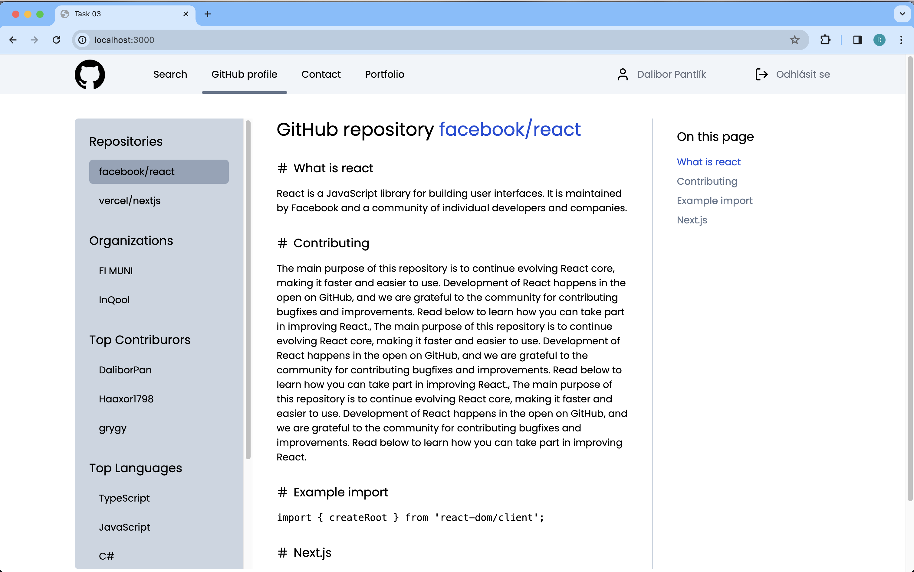
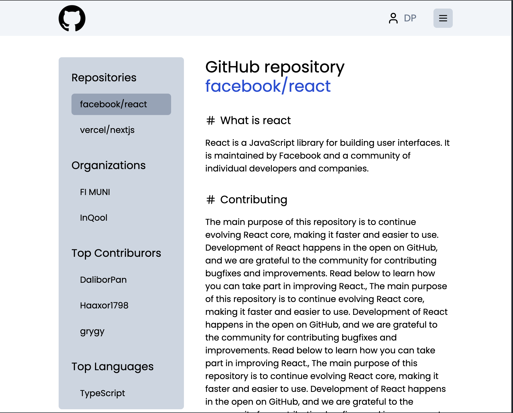

# Task 03 - Tailwindcss

This week we will practice styling using tailwindcss. Your task is to create and style a single page displaying a simple description of a GitHub repository. The page includes:

- Top navigation.
- Left sidebar.
- The main content.
- Right-side navigation within the currently displayed page.

There are attached screenshots of the final solution you need to achieve below.

## Requirements

- The page must contain all the components on the page as in the attached screenshot.
- The page must be responsive. Three common breakpoints (mobile, tablet, desktop) must be implemented.
- On the desktop, all three main components are on the page - left sidebar, main content, and right sidebar.
- Only the left sidebar and main content are present on a tablet - the right sidebar is hidden.
- Only the main content is shown on mobile - both the left and right sidebar are hidden.
- The top navigation is also collapsed into a hamburger menu on both tablet and mobile. Clicking on the menu **doesn't** show any dropdown or anything else. The page is supposed to be completely non-interactive.
- Basic accessibility principles must be followed, especially using HTML5 semantic tags.
- Your solution does not need to have the same dimensions per pixel, spacing, etc., as the attached screenshot but must have the same layout of elements.
- Decompose your solution into components, which you keep in the `./src/components` directory. Use accurate naming.
- Most text (displayed data) is prepared for you in the `src/data/index.ts` file.
  - Navigation items as `navigationItems`. Use **your name** in header.
  - Left sidebar items as `sidebarItems`.
  - Main content as `repository`.
  - Right sidebar items consists of titles in `repository` object.

## Maximum points: 30

## Tips

- You have installed the [lucide](https://lucide.dev/icons/) component package. The solution uses icons that you can import as follows:

  ```js
  import { User, LogOut, Menu, Hash } from 'lucide-react';
  ```

  and render them as follows:

  ```jsx
  <User />
  ```

  If you would like to change the size of the icon, you can use the `size` props:

  ```jsx
  <Menu size={20} />
  ```

- You can find the GitHub logo in the `public` folder and use it as follows:

  ```jsx
  import Image from 'next/image';

  // Usage

  <Image src="/github.png" alt="GitHub logo" width={50} height={50} />;
  ```

- "Example import" section on the page uses `<code>` tag to render a content.
- There are supposed to be links in both the left and right sidebars. You can target the `/` page for simplicity.

### Desktop



### Tablet



### Mobile


## Deadline:

- 1st group - 11.3. 23:59
- 2nd group - 12.3. 23:59

## Submission

There should be created a pull request called "Feedback" immediately after accepting the github classroom assignment.

**If you have a Feedback pull request**

You can push your solution straight to `main`. You will then see the diff against main in the pull request feedback. Once you have the solution in main, mark the Feedback PR as submitted.

**If you don't have a Feedback pull request**

It may be that it will be created later, or it may not be created at all... Therefore, as a precaution, create a new branch `solution` from main as soon as you accept the assignment, and then push your solution to it.

- If the Feedback PR does not appear, make a pull request from your `solution` branch to mainu and mark this PR as submitted.
- If the Feedback PR does appear, merge your branch `solution` into main, then mark the Feedback PR as submitted.
